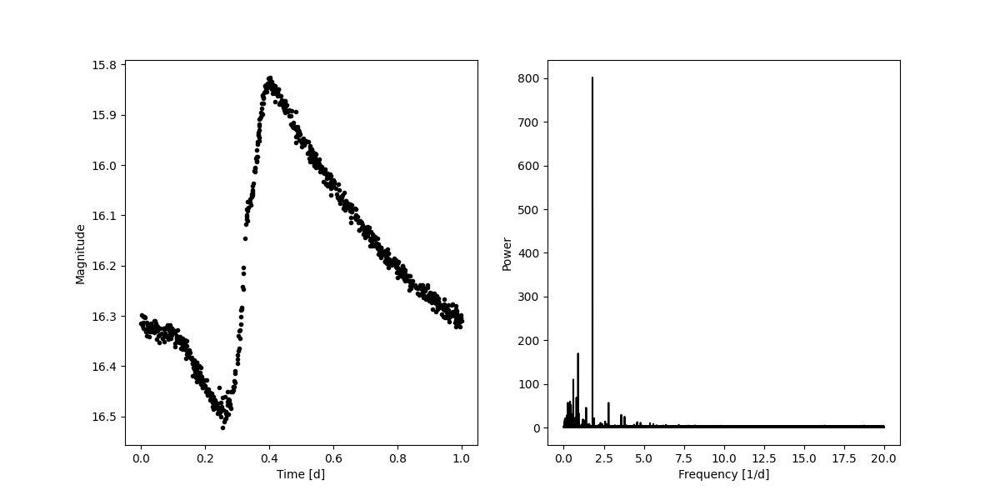

# FAOV

The Fast AOV algorithm for period fitting is a simple library written in low-level C with the assistance of SIMD instructions.
Library utilizes AVX2 instructions to accelerate the computations. Library provides Numpy interface to the routines via Python/Numpy C API.
Library is based on the code written by Przemysław Mróz @ Caltech.

There are two main functions exposed to the user:

* **Power**: Provides an array of frequencies and an array with power.
* **Period**: Returns the best period from the periodogram.

To utilize both functions, one needs to supply four parameters:

* Time array
* Magnitude array
* Number of bins to use (usually 10 are enough)
* Maximum time considered:
  * If lower than zero, the maximal time span is used.
  * Otherwise, the supplied value is used.

